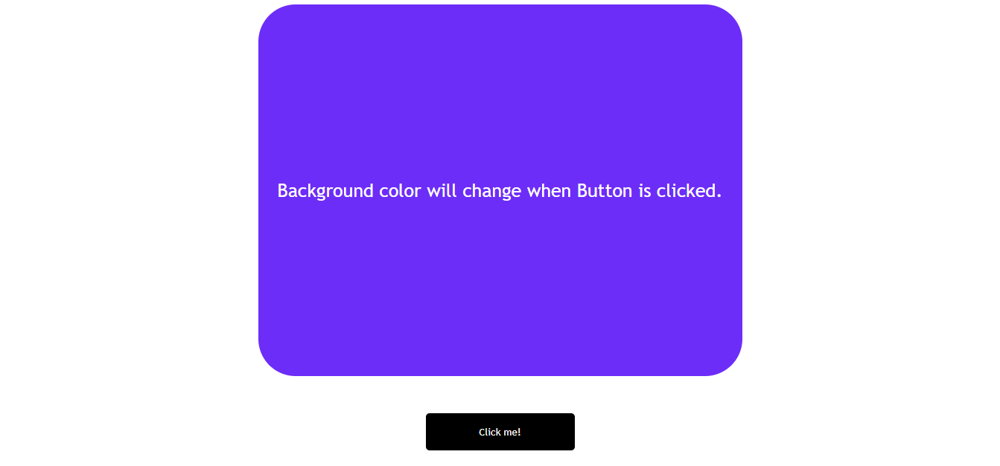
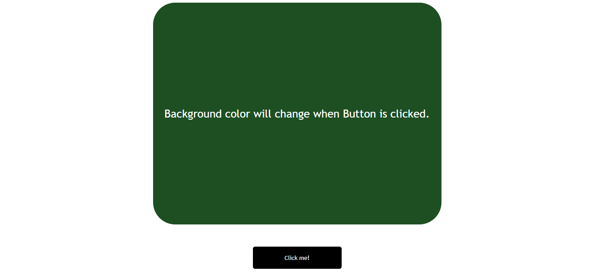

# PRANAV MATHUR

## Learnings from the project:

- DOM methods like _getElementById_ and **addEventListener**
- Generating random Hex colours

## Time taken:

    It took me 30 minutes to complete this project.

## Screenshots:

## Live link:

[Go to site](https://03-colour-changer.netlify.app/)
